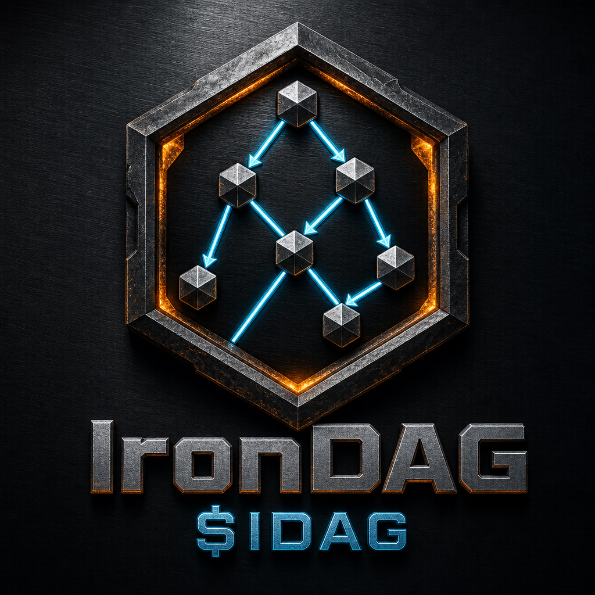

# IronDAG

<div align="center">



**Post-Quantum AI-Native Layer 1 Blockchain**

[](LICENSE)
[](https://www.rust-lang.org/)
[](https://ethereum.org/)
[](https://irondag.io)
[](https://explorer.irondag.io)

[Website](https://irondag.io) &nbsp;|&nbsp; [Explorer](https://explorer.irondag.io) &nbsp;|&nbsp; [Whitepaper](IronDAG_WHITEPAPER.md) &nbsp;|&nbsp; [Twitter](https://x.com/DevIronDAG) &nbsp;|&nbsp; [Wiki](https://github.com/RunTimeAdmin/IronDAG/wiki)

</div>

---

## Overview

**IronDAG** is an industrial-strength Layer 1 blockchain built for the post-quantum era — combining GhostDAG parallel consensus with BraidCore dual-stream mining and full EVM compatibility.

| Field | Value |
|-------|-------|
| **Ticker** | $IDAG |
| **Max Supply** | 10,000,000,000 IDAG (10B); 70% mining, 30% genesis (vested) |
| **Chain ID** | 11567 |
| **Consensus** | GhostDAG (BlockDAG — parallel block production) |
| **Mining** | BraidCore: Stream A (Blake3, ~10s, 50 IDAG) + Stream B (B3MemHash, ~5s, 25 IDAG) |
| **Smart Contracts** | Full EVM compatibility via SputnikVM |
| **Security** | NIST post-quantum signatures (ML-DSA / Dilithium) |
| **Fee Model** | 50% of transaction fees burned per block |

---

## BraidCore Mining

BraidCore is IronDAG's dual-stream parallel mining architecture. Two independent PoW streams cross-reference each other at the parent level, braiding into a single GhostDAG consensus layer:

| Stream | Algorithm | Target Block Time | Reward | Hardware |
|--------|-----------|-------------------|--------|----------|
| **Stream A** | Blake3 | ~10 seconds | 50 IDAG | CPU / GPU |
| **Stream B** | B3MemHash (SIMD, 256KB memory-hard) | ~5 seconds | 25 IDAG | CPU (memory-bound) |

Both streams are actively mining on testnet. Full GPU / ASIC differentiation is planned for mainnet.

---

## Technical Highlights

- **GhostDAG Consensus** — DAG-based consensus allowing parallel block production with blue-score finality
- **EVM Compatible** — Deploy Solidity contracts, use MetaMask, ethers.js, Foundry
- **SIMD-Accelerated Mining** — AVX2/SSE2 optimized B3MemHash for Stream B
- **Post-Quantum Ready** — Dilithium signatures, Kyber key exchange, Noise Protocol P2P encryption
- **Verkle State Proofs** — Wide 256-way branching tree with KZG polynomial commitments for O(1) stateless verification
- **Account Abstraction (ERC-4337)** — Smart contract wallets with flexible signature schemes and gas sponsorship
- **Privacy Layer** — Feature-gated confidential transactions with zk-SNARK dual commitments
- **Parallel EVM Execution** — Multi-threaded transaction execution with conflict detection and automatic retry
- **Horizontal Sharding** — Phase 1–6 complete; cross-shard transaction routing and unified stream sources
- **Gossip Protocol** — Seen-set deduplication, random fanout relay, compact blocks, latency-aware routing
- **Desktop Wallet** — Tauri-based native wallet for Windows, macOS, and Linux

---

## Quick Start

### Prerequisites

- **Rust** 1.75+ ([Install](https://rustup.rs))
- **protoc** (Protocol Buffers compiler): [Install on Windows](docs/INSTALL_PROTOC.md)
- **Node.js** 18+ (for the explorer and tooling)
- **Foundry** (optional, for Solidity tests): [Install Forge on Windows](docs/INSTALL_FORGE.md)

### Dev Setup

After cloning, run the setup script to enable git hooks (prevents accidental IP leaks in docs):

```bash
# Linux/macOS
bash scripts/setup-dev.sh

# Windows (PowerShell)
.\scripts\setup-dev.ps1
```

### Run a Node

```bash
git clone https://github.com/RunTimeAdmin/IronDAG.git
cd IronDAG/irondag-blockchain

cargo build --release
cargo run --release --bin node -- --port 9090
```

To stop all IronDAG processes and free ports for rebuilds:

```powershell
.\scripts\stop_local_nodes.ps1
```

### Connect MetaMask

| Setting | Value |
|---------|-------|
| Network Name | IronDAG Testnet |
| RPC URL | `http://localhost:8546` |
| Chain ID | `11567` |
| Currency Symbol | `IDAG` |

### CLI Reference

**Network & Discovery:**
- `--port <PORT>` — P2P port (default: 8080)
- `--rpc-port <PORT>` — JSON-RPC port (default: 8546)
- `--bootstrap-peer <ADDR>` — Initial peer (IP:PORT)
- `--advertise <ADDR>` — Public address for P2P handshake
- `--max-peers <N>` — Peer limit (default: 50)

**Mining:**
- `--miner-address <HEX>` — Reward address (40 hex chars, optional 0x prefix)
- `--disable-mining` — Start without mining
- `--single-stream` — Mine Stream A only
- `--enable-stream-c` — Enable ZK proving stream (experimental)

**Security & TLS:**
- `--tls-cert <PATH>` — TLS certificate for HTTPS RPC
- `--tls-key <PATH>` — TLS private key
- `--data-dir <PATH>` — Blockchain data directory

**Chain Configuration:**
- `--chain-id <ID>` — EIP-155 chain ID (default: 11567)
- `--genesis-file <PATH>` — Custom genesis allocations (JSON)

Run `irondag-node --help` for the full reference.

---

## Project Structure

```
IronDAG/
├── irondag-blockchain/     # Rust blockchain node
│   └── src/
│       ├── blockchain/     # Core blockchain logic
│       ├── consensus/      # GhostDAG consensus
│       ├── evm/            # EVM integration (SputnikVM)
│       ├── mining/         # BraidCore mining (Stream A + B)
│       ├── network/        # P2P networking (QUIC + Noise)
│       ├── sharding/       # Horizontal sharding
│       ├── security/       # Rule-based fraud detection
│       └── rpc/            # JSON-RPC API
├── irondag-explorer/       # React+Vite block explorer
├── irondag-desktop/        # Tauri desktop wallet
├── contracts/              # Solidity smart contracts
├── brand-assets/           # Logos, banners, icons
└── docs/                   # Documentation
```

---

## Documentation

| Document | Description |
|----------|-------------|
| [Whitepaper](IronDAG_WHITEPAPER.md) | Technical vision and architecture |
| [Tokenomics](TOKENOMICS.md) | $IDAG economics: 10B supply, 70/30 split, BraidCore emission, fee burn |
| [API Reference](JSON_RPC_API_GUIDE.md) | JSON-RPC API (30+ methods, irondag_ namespace) |
| [Node Setup](NODE_QUICK_START.md) | Running a node |
| [MetaMask Guide](METAMASK_CONNECTION_GUIDE.md) | Wallet connection |
| [Wiki](https://github.com/RunTimeAdmin/IronDAG/wiki) | Full documentation |

---

## Live Testnet

Two-node public testnet with both BraidCore streams active:

| Component | Details |
|-----------|---------|
| **Nodes** | Primary miner + sync node |
| **Explorer** | https://explorer.irondag.io |
| **Faucet** | 10 IDAG per request (enabled) |
| **P2P Transport** | QUIC with Kyber post-quantum key exchange |

---

## Status

| Component | Status |
|-----------|--------|
| Core Blockchain (GhostDAG + BraidCore) | ✅ Operational |
| Stream A Mining (Blake3) | ✅ Active on testnet |
| Stream B Mining (B3MemHash) | ✅ Active on testnet |
| EVM (SputnikVM) | ✅ Full Ethereum compatibility |
| Parallel EVM Execution | ✅ Multi-threaded with conflict detection |
| Verkle State Proofs | ✅ KZG commitments, O(1) stateless verification |
| P2P (Noise Protocol XX) | ✅ Encrypted, all 6 hardening items complete |
| JSON-RPC API | ✅ 30+ methods, irondag_ namespace, TLS |
| gRPC API | ✅ v1 + v2 (3.3x faster binary-optimized) |
| MetaMask / Web3 | ✅ Native compatibility |
| Horizontal Sharding | ✅ Phase 1–6 complete |
| Account Abstraction (ERC-4337) | ✅ Complete |
| Privacy Layer | ✅ Feature-flagged (--privacy-* flags) |
| ZK Proving (Stream C) | ⚠️ Experimental — Groth16 integrated, soft verification |
| Block Explorer | ✅ Live at explorer.irondag.io |
| Desktop Wallet | ✅ v0.2.0 — encrypted keystore, auto-updater |
| External Security Audit | Pending |

> **Note:** This is alpha/testnet software. Not production-ready.

---

## Tokenomics

| Metric | Value |
|--------|-------|
| **Max Supply** | 10,000,000,000 IDAG |
| **Mining Emission** | 70% (~30-year smooth decay) |
| **Genesis (vested)** | 30% — Ecosystem 8%, IKO 7%, Team 5%, Dev 4%, Liquidity 3%, Marketing 2%, Treasury 1% |
| **TGE Circulating** | ~1.4% of supply |
| **Fee Burn** | 50% of transaction fees per block |

See [TOKENOMICS.md](TOKENOMICS.md) for full allocations, vesting schedule, and IKO details.

---

## Contributing

Contributions are welcome. Please see [CONTRIBUTING.md](CONTRIBUTING.md), [CODE_OF_CONDUCT.md](CODE_OF_CONDUCT.md), and [SECURITY.md](SECURITY.md).

---

## Community

- **Website**: [irondag.io](https://irondag.io)
- **Twitter/X**: [@DevIronDAG](https://x.com/DevIronDAG)
- **Explorer**: [explorer.irondag.io](https://explorer.irondag.io)
- **GitHub**: [RunTimeAdmin/IronDAG](https://github.com/RunTimeAdmin/IronDAG)

---

## License

Business Source License 1.1 — see [LICENSE](LICENSE).

Converts to Apache License 2.0 on April 1, 2030.

**Copyright © 2024–2026 IronDAG**

---

<div align="center">

**Built with Rust** | **EVM Compatible** | **Post-Quantum Ready**

</div>

---

*Created by David Cooper — CCIE #11567*
