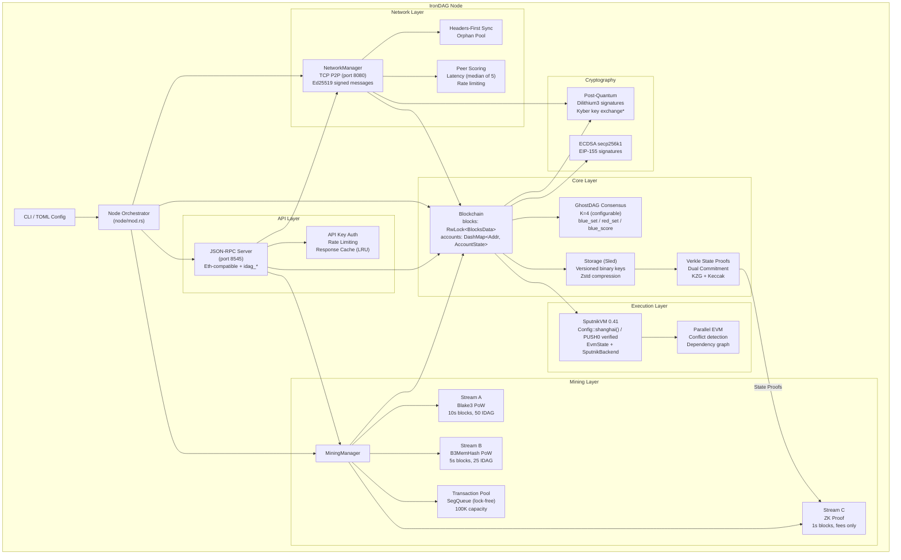
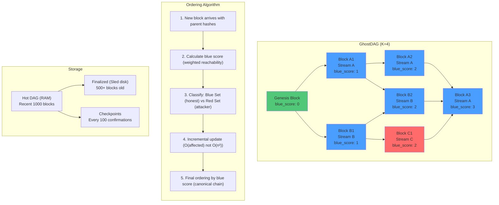
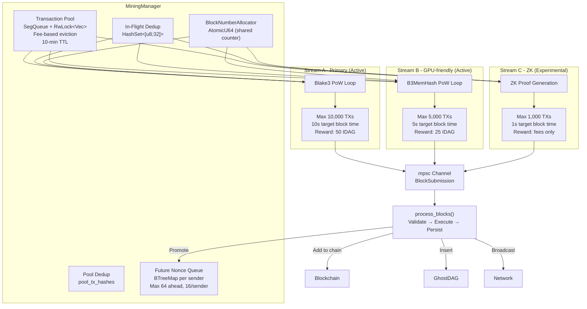
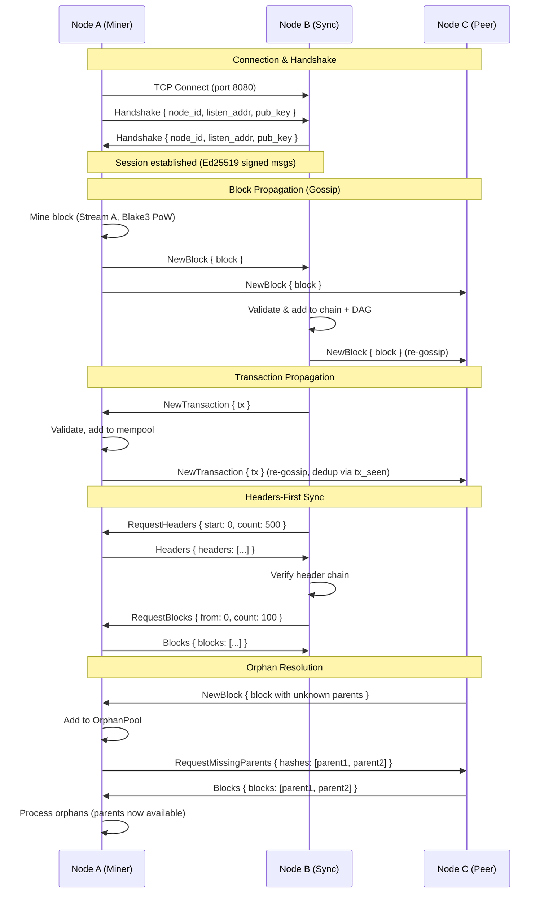
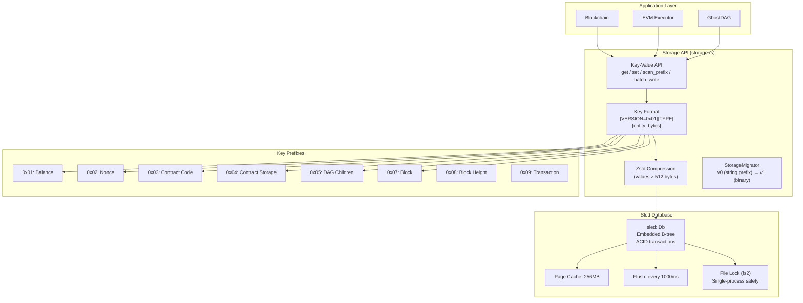
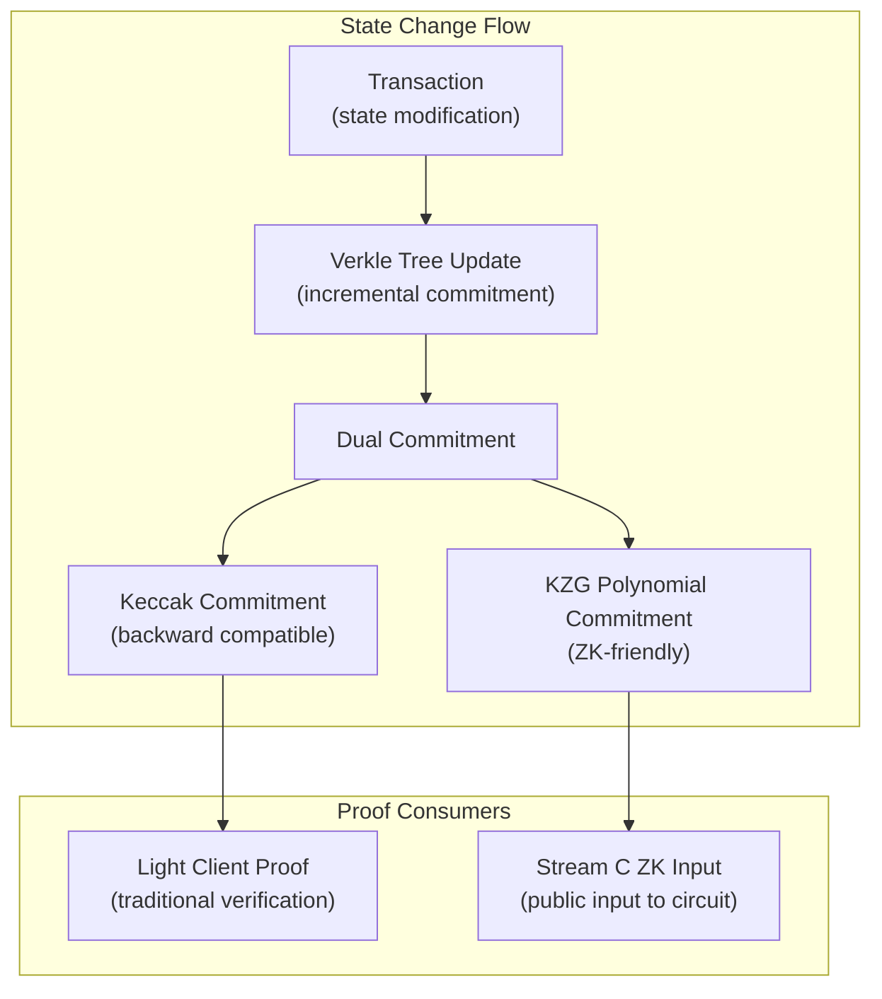
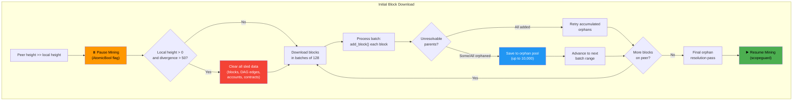

# IronDAG Blockchain Architecture

This document provides comprehensive architecture diagrams for the IronDAG blockchain node.

---

## Diagram 1: System Architecture (Node Components)

A block diagram showing the major node components and their relationships:

> **Note:** * Kyber key exchange is feature-flagged and optional. Enable via `--features kyber` in Cargo.toml. Includes HKDF domain separation and session caching.

---

## Diagram 2: Transaction Lifecycle

A sequence/flow diagram showing a transaction from submission to finality:

```mermaid
flowchart LR
    subgraph "1. Submission"
        RPC_IN["JSON-RPC<br/>eth_sendRawTransaction"]
        P2P_IN["P2P Gossip<br/>NewTransaction msg"]
    end
    
    subgraph "2. Validation"
        SIG["Signature Verify<br/>(ECDSA / Dilithium3)"]
        NONCE["Nonce Check<br/>(sequential or queue)"]
        BAL["Balance Check<br/>(value + fee ≤ balance)"]
        GAS["Gas/Fee Check<br/>(gas_limit ≤ 30M, fee > 0)"]
        DATA["Data Size Check<br/>(≤ 128 KB)"]
    end
    
    subgraph "3. Mempool"
        DEDUP["Pool Dedup<br/>(pool_tx_hashes)"]
        READY["Ready Queue<br/>(nonce matches)"]
        FUTURE["Future Queue<br/>(nonce gap ≤ 64)"]
    end
    
    subgraph "4. Block Assembly"
        SELECT["Fee-Priority Selection"]
        TRIM["Trim to 4MB<br/>(binary search)"]
        INFLIGHT["In-Flight Guard<br/>(cross-stream dedup)"]
    end
    
    subgraph "5. Execution"
        POW["PoW Mining<br/>(Blake3 / B3MemHash)"]
        PROC["process_blocks()<br/>BLOCK_PROCESSING_LOCK"]
        EVM_EXEC["EVM Execution<br/>(if contract tx)"]
        STATE["State Update<br/>DashMap + Sled"]
    end
    
    subgraph "6. Consensus"
        DAG["GhostDAG Insert<br/>Blue score calc"]
        ORDER["Canonical Ordering"]
        BCAST["Broadcast to Peers"]
    end
    
    RPC_IN --> SIG
    P2P_IN --> SIG
    SIG --> NONCE --> BAL --> GAS --> DATA
    DATA --> DEDUP
    DEDUP --> READY
    DEDUP --> FUTURE
    FUTURE -.->|"gap fills"| READY
    READY --> SELECT --> TRIM --> INFLIGHT
    INFLIGHT --> POW --> PROC --> EVM_EXEC --> STATE
    STATE --> DAG --> ORDER --> BCAST
```

---

## Diagram 3: GhostDAG Consensus

A diagram showing DAG structure and blue/red set selection:

**Legend:**
- **Blue** = Blue Set (honest majority)
- **Red** = Red Set
- **Green** = Genesis

---

## Diagram 4: BraidCore Mining Architecture

---

## Diagram 5: P2P Network Flow

---

## Diagram 6: Storage Architecture

---

## Diagram 7: Verkle State Proofs and Stream C

Verkle trees provide the foundation for IronDAG's stateless verification architecture,
enabling light clients to verify state transitions without storing the full blockchain state.

### Stateless Verification

Verkle trees replace Merkle-Patricia trees with polynomial commitments, reducing proof
size from O(log n) to O(1):

| Proof Type | Size | Verification |
|------------|------|--------------|
| Merkle Proof | ~1KB (256 hashes) | 256 Keccak hashes |
| Verkle Proof | ~200 bytes | 1 pairing check |
| KZG Verkle Proof | 32 bytes | 1 pairing check |

Light clients can verify any state value (balance, nonce, contract storage) by:
1. Holding only the current Verkle root (32 bytes)
2. Receiving a Verkle proof for the specific state path
3. Verifying the proof against the known root

### Dual Commitment Pattern

The `DualCommitment` structure bridges backward compatibility with ZK-friendly proofs:

- **Keccak Commitment**: Traditional hash-based commitment for backward compatibility
  with existing light client infrastructure. Used for standard state verification.

- **KZG Polynomial Commitment**: Zero-knowledge-friendly commitment enabling efficient
  in-circuit verification. Used by Stream C for ZK proof generation.

This dual approach allows the same Verkle tree to serve both traditional light clients
and advanced ZK proving systems without maintaining separate data structures.

### Stream C Integration

Stream C (ZK proof mining) uses Verkle state roots as public inputs to the
`StateTransitionCircuit`. The integration flow:

1. **Pre-state Root**: Current state root before transaction execution (public input)
2. **State Transition**: Transaction modifies balances, nonces, contract storage
3. **Post-state Root**: New state root after transaction execution (public input)
4. **Verkle Proof**: Proves that specific state values (e.g., sender balance)
   are committed to by the pre-state root
5. **ZK Proof**: Circuit proves correct state transition from pre to post root

The circuit includes:
- `VerklePathWitness`: Witness data for in-circuit path verification
- `verify_verkle_path_gadget()`: MiMC-based hash gadget for path verification
- Balance proofs: Authenticate sender/receiver balances from Verkle state

### Proof Efficiency in ZK Circuits

Traditional Merkle proofs require hundreds of hash operations inside the ZK circuit,
each consuming constraints. KZG-based Verkle proofs achieve:

- **Constant proof size**: 32 bytes regardless of tree depth
- **Constant verification**: Single pairing check (few constraints)
- **MiMC hashing**: ~50 constraints per balance proof vs. thousands for Merkle

This efficiency makes state proofs practical within the constraint budget of
Stream C's zero-knowledge circuits.

---

## Concurrency Model

- `blocks`: `RwLock<BlocksData>` — write-heavy during mining
- `accounts`: `DashMap<Address, AccountState>` — lock-free concurrent reads (RPC)
- `cached_latest_block_number`: `AtomicU64` — zero-lock height queries
- `BLOCK_PROCESSING_LOCK`: `parking_lot::Mutex` — prevents TOCTOU during validation
- All std Mutex/RwLock acquisitions use `.unwrap_or_else(|e| e.into_inner())` for poison recovery

---

## Known Limitations

- **Sharding**: Placeholder framework — all transactions execute on shard 0
- **DAG Finality**: No BFT finality gadget; deep reorgs possible with sufficient hashrate
- **PQ Crypto**: Kyber key exchange feature-flagged (optional, enable with `--features kyber`)
- **EVM Revision**: SputnikVM 0.41 with `Config::shanghai()`; PUSH0 (EIP-3855) verified; other Shanghai/Cancun changes untested

---

## Diagram 7: Synchronization Resilience (IBD & Fork Recovery)

### Mining Pause During IBD

When a node detects that a peer has significantly more blocks, it enters IBD:

1. **All 3 BraidCore Mining streams pause** via a shared `AtomicBool` flag
2. Each stream checks `syncing.load(Ordering::Acquire)` before each round
3. Blocks are downloaded and processed without interference from local mining
4. Mining **resumes automatically** after sync completes — guaranteed by `scopeguard`
5. Prevents DAG tip contamination from concurrent block production

### Orphan Block Retention

During batch sync, blocks with unresolvable parents are retained:

1. Orphaned blocks saved to `accumulated_orphans` (cap: 10,000 blocks)
2. After each batch where blocks are added, accumulated orphans are retried
3. Final orphan resolution pass at end of sync loop
4. Prevents loss of valid blocks that arrive before their parents

### Fork Recovery with Comprehensive Storage Clear

When `peer_height > local_height + 50` and `local_height > 0`:

1. `clear_for_resync()` clears all in-memory state (blocks, GhostDAG, accounts)
2. `BlockStore::clear_all()` clears ALL sled prefixes:
   - `BLOCK (0x07)` — block data
   - `CHILDREN (0x05)` / `PARENTS (0x06)` — DAG edges
   - `BALANCE (0x01)` / `NONCE (0x02)` — account state
   - `CONTRACT (0x03)` / `CONTRACT_STORAGE (0x04)` — contract data
   - `BLOCK_HEIGHT (0x08)` — height index
3. Sync restarts from block 0 with a clean slate

### Sync Stall Prevention

When an entire batch contains only orphaned blocks:

1. Batch is not discarded — orphans saved for later retry
2. Sync advances `current` to `highest_in_batch + 1`
3. Next batch is requested from peer
4. Prevents indefinite stall on all-orphaned responses

